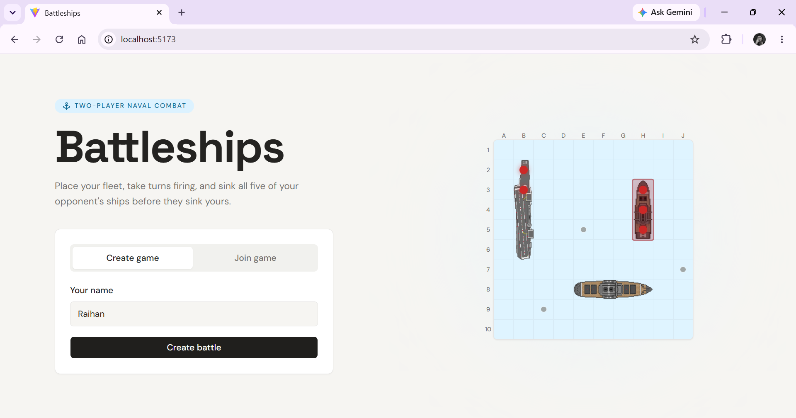
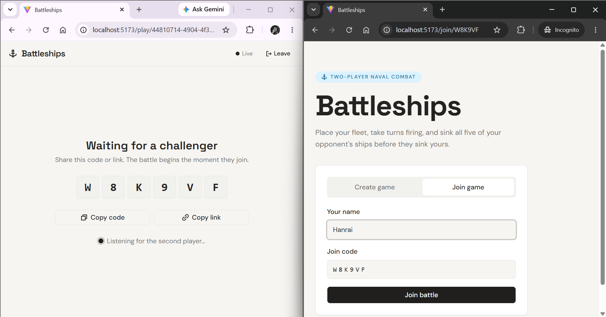
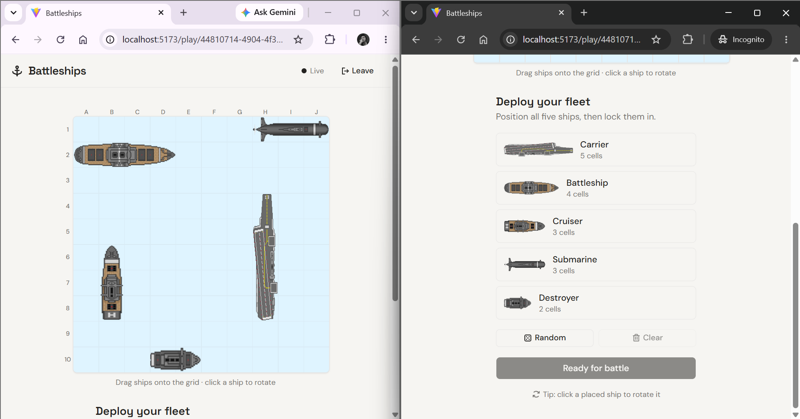
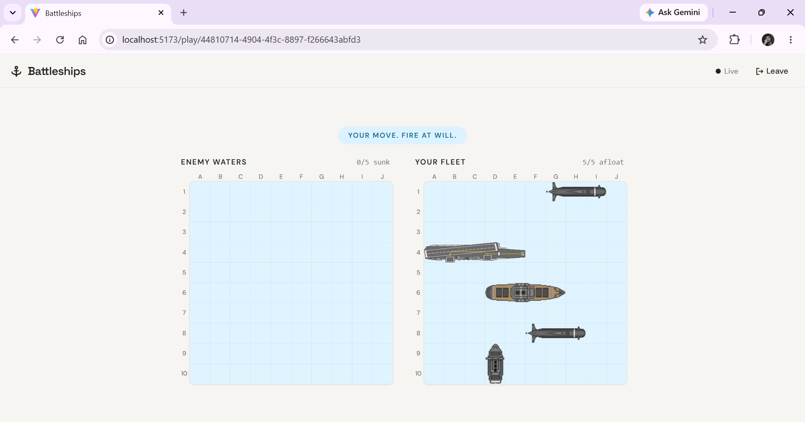
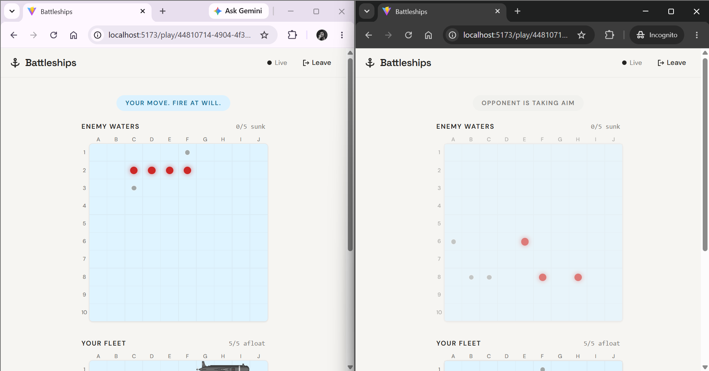
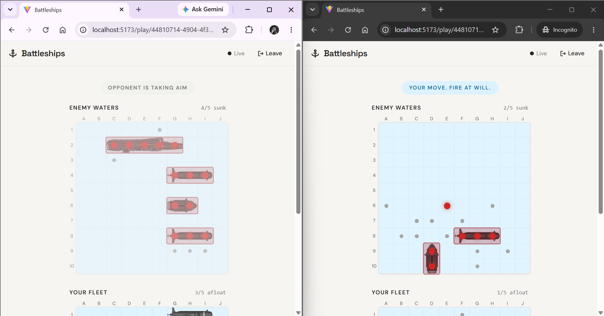
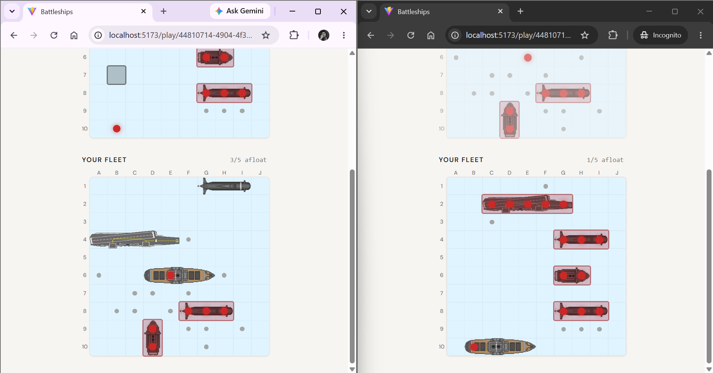
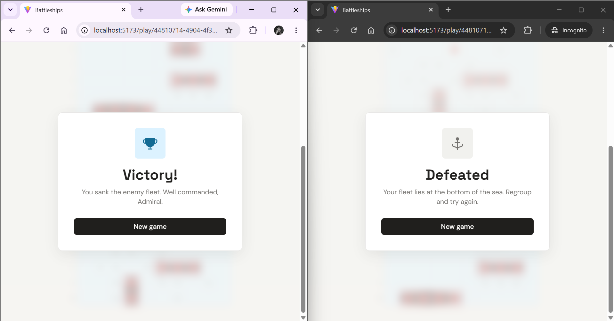

# Battleships

Two admirals, one board each, zero mercy. Place your fleet, call your shots, and sink the other side before they sink you. Built as part of Formulatrix CS Bootcamp Batch 19.



## How a match plays out

**Create or join.** One player creates a game and gets a join code. The other enters it. No accounts, no lobbies to browse.



**Deploy your fleet.** Five ships, one board: a 5-cell Carrier, a 4-cell Battleship, two 3-cell ships (Cruiser and Submarine), and a 2-cell Destroyer. Drag them onto the grid, rotate with a click, or hit Random if you're in a hurry. Ships can't touch, not even diagonally, so plan your spacing.



**Fire at will.** Turns alternate. Call a coordinate, watch it land on your opponent's board, and hunt for the next hit. A live connection pushes every shot to both boards the second it's fired, so you see your opponent's move as it happens.









**Sink the fleet, win the game.** Land the last hit on your opponent's final ship and the game ends on the spot for both players.



## What makes it feel real

- **Live sync, not polling.** A SignalR connection pushes every attack, phase change, and game-over event to both boards the instant it happens.
- **Drag-and-drop placement.** Built with `@dnd-kit`, so placing your fleet feels like arranging pieces on a table.
- **No signup friction.** A join code and a name get you into a match.
- **Server-side rules enforcement.** Ship lengths, board bounds, adjacency, turn order, all validated on the API, so the client can't cheat the board.

## Tech stack

| Layer | Technology |
|---|---|
| API | ASP.NET Core 8, Entity Framework Core, SQLite |
| Real-time | SignalR |
| Frontend | React 19, TypeScript, Vite |
| State | Zustand |
| Styling | Tailwind CSS 4, Radix UI |
| Drag & drop | @dnd-kit |
| Animation | Framer Motion |

## Running it locally

### API

```bash
cd BattleshipsGameApi
dotnet restore
dotnet ef database update
dotnet run
```

The API listens on `http://localhost:5280`, with Swagger at `http://localhost:5280/swagger`.

### UI

```bash
cd BattleshipsGameUI
npm install
npm run dev
```

The UI runs on `http://localhost:5173` and talks to the API at `http://localhost:5280` by default. Override with `VITE_API_BASE_URL` if your API runs elsewhere.

Open two browser windows (or one normal, one incognito), create a game in one, join with the code in the other, and the fleet's yours to command.
